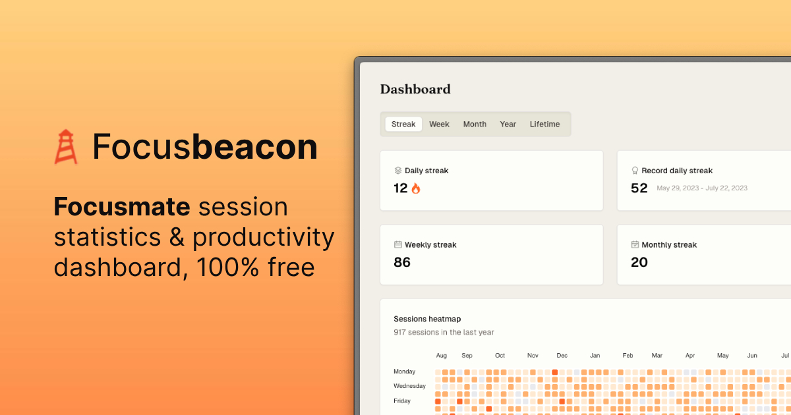

<div align="center">
  <br />
  <h2>Focus<b>beacon</b></h2>
  <p>Focusmate session statistics & productivity dashboard</p>
  <p>
    <a href="https://www.focusbeacon.com/dashboard/streak?demo=true">View demo</a>
    ·
    <a href="https://github.com/qu8n/focusbeacon/issues/new?assignees=&labels=&projects=&template=bug_report.md&title=">Bug report</a>
    ·
    <a href="https://github.com/qu8n/focusbeacon/issues/new?assignees=&labels=&projects=&template=feature_request.md&title=">Feature request</a>
  </p>

[](https://python.org "Go to Python homepage")
[](https://nodejs.org "Go to Node.js homepage")


</div>



## Technologies

**Backend**

- **Python** for data processing
- **FastAPI** for the REST API
- **Supabase** for the PostgreSQL database
- **Vercel** for hosting
- **PostHog** for logging

**Frontend**

- **TypeScript** for type safety
- **React.js** for the UI
- **Next.js App Router** for routing
- **TailwindCSS** for styling

For authentication, we use the
[Backend for Frontend pattern](https://stackoverflow.com/a/76849791)
with Focusmate as the identity provider via OAuth 2.0. Focusbeacon is the first
and only non-commercial app to be approved by Focusmate for this purpose!

## Getting started locally

1. Clone this repo to your local machine

```sh
git clone https://github.com/qu8n/focusbeacon.git
```

2. Navigate to the project directory

```sh
cd focusbeacon
```

3. Ensure the following language versions are used in your local environment:

- Node.js (v20.x)
- Python (v3.12)

4. Install packages with npm

```sh
npm install
```

5. Create a Python virtual environment

```sh
python3 -m venv venv
```

6. Install Python dependencies

```sh
pip install -r requirements.txt
```

7. Create an `.env` file in the root directory following the `.env.example`
template and fill in the required values

```sh
cp .env.example .env
```

8. Activate the Python virtual environment

```sh
source venv/bin/activate
```

9. Run the app in development mode. This command will start the FastAPI server
and the Next.js server concurrently

```sh
npm run dev
```

## Update Supabase types using the CLI

**Initialize a local Supabase project:** (only needs to be done once)

```zsh
npx supabase login
npx supabase init
```

This will create a `supabase` directory in your project.

**Automatically generate TypeScript types for your Supabase tables:**

```zsh
npm run supabase-typegen
```

Note that this script only works on Linux/MacOS because of the way it accesses`
.env` file.

## Contributing

By default, contributors will not have access to the Focusmate OAuth login nor
production database. If your contributions require access to these, please reach
out to me [here](https://docs.google.com/forms/d/e/1FAIpQLSe_RQHoYkOT_zlF423xyZdIO5dBehJp6i0uY-bjoSFfN62zNQ/viewform).
Meanwhile, you can still use the demo view to test your changes.

If you have a suggestion that would make this better, feel free to fork the repo
and create a pull request. I'm also happy to chat over a Focusmate session to get
you started with the codebase.
