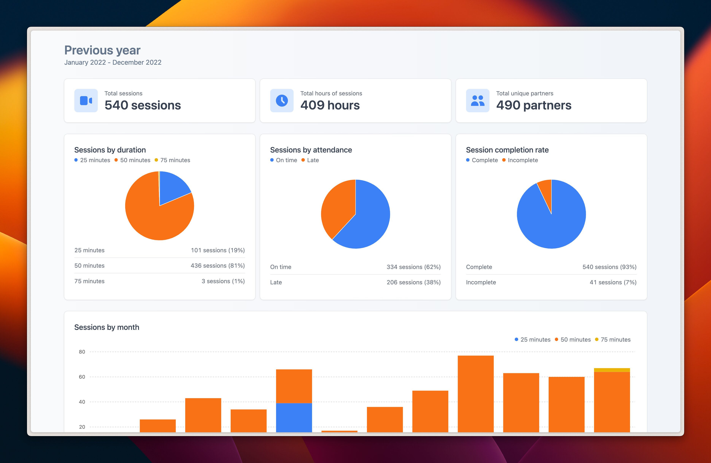

<a name="readme-top"></a>

<br />
<div align="center">
  <a href="https://github.com/qu8n/FocusBeacon">
    
  </a>

<h3 align="center">FocusBeacon</h3>

  <p align="center">
    Unofficial Focusmate metrics dashboard
    <br />
    <a href="https://www.focusbeacon.com/dashboard/demo">View Demo</a>
    ·
    <a href="https://github.com/qu8n/FocusBeacon/issues">Report Bug</a>
    ·
    <a href="https://github.com/qu8n/FocusBeacon/issues">Request Feature</a>
  </p>
</div>

<br />


## Built with

* Frontend: React, Tremor.so, Headless UI, TailwindCSS
* Backend: Next.js, Supabase's Postgres database, Vercel

## Getting started locally

1. Log in to your Focusmate account
2. Navigate to your profile [settings](https://www.focusmate.com/profile/edit-p)
3. Click on `Generate API key` and save the API key for a later step
4. Clone this repo to your local machine
   ```sh
   git clone https://github.com/qu8n/focusbeacon.git
   ```
5. Navigate to the project directory
   ```sh
   cd focusbeacon
   ```
6. Use the Node version specified for this project
   ```sh
   nvm use
   ```
7. Install packages with npm
   ```sh
   npm install
   ```
8. Create an `.env` file in the root directory
9. Enter the environment variables in the `.env` file
   ```
   DEMO_FOCUSMATE_API_KEY="YOUR_API_KEY"
   ```
10. Run the app in development mode
   ```sh
   npm run dev
   ```
11. Open [localhost:3000/dashboard/demo](http://localhost:3000/dashboard/demo) to view your metrics in the browser

## Contributing

By default, contributors will not have access to the Focusmate OAuth login nor production database. If your contributions require access to these, please reach out to me on [LinkedIn](https://www.linkedin.com/in/nguyenhq/).

If you have a suggestion that would make this better, feel free to fork the repo and create a pull request. I'm also happy to chat over a Focusmate session to get you started with the codebase.