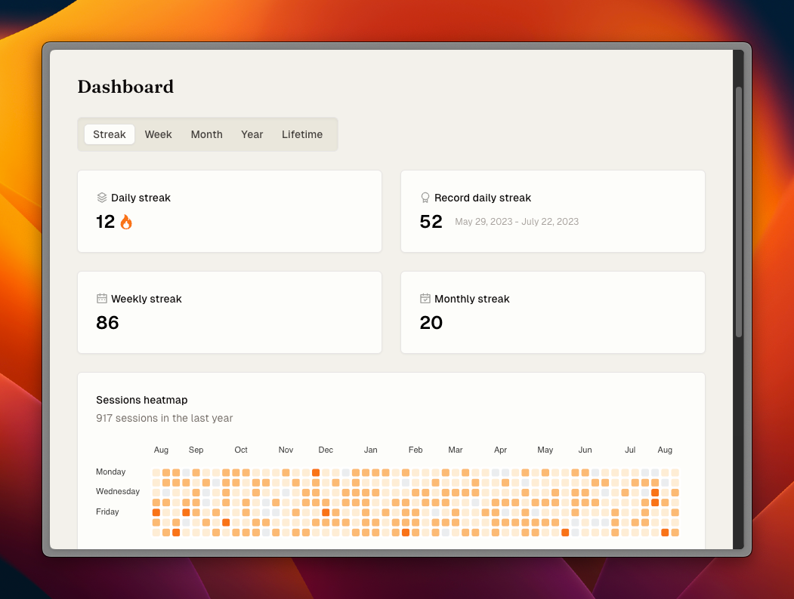

<a name="readme-top"></a>

<br />
<div align="center">
  <p style="font-size:2em;">Focus<b>beacon</b></p>
  <p>
    Session statistics & productivity dashboard for Focusmate users
    <br />
    <a href="https://www.focusbeacon.com/dashboard/streak?demo=true">View demo</a>
    ·
    <a href="https://github.com/qu8n/focusbeacon/issues/new?assignees=&labels=&projects=&template=bug_report.md&title=">Bug report</a>
    ·
    <a href="https://github.com/qu8n/focusbeacon/issues/new?assignees=&labels=&projects=&template=feature_request.md&title=">Feature request</a>
  </p>

[](https://python.org "Go to Python homepage")
[](https://nodejs.org "Go to Node.js homepage")


</div>

<br />


## Technologies

Focusbeacon uses the [Backend for Frontend (BFF) pattern](https://stackoverflow.com/a/76849791) for user authentication using OAuth 2.0, with Focusmate as the identity provider (IDP), and for handling data processing.

**Backend**

- Python with Pandas (data processing)
- FastAPI (API endpoints)
- Supabase (Postgres database)
- Vercel (hosting)

**Frontend**

- TypeScript (static typing)
- React.js (UI library)
- Next.js App Router (server-side rendering)
- TailwindCSS (styling)
- Tremor.so and shadcn/ui (pre-built UI components)

## Getting started locally

1. Clone this repo to your local machine

```sh
git clone https://github.com/qu8n/focusbeacon.git
```

2. Navigate to the project directory

```sh
cd focusbeacon
```

3. Ensure the following language versions are used:

- Node.js (v20.x)
- Python (v3.12)

4. Install packages with npm

```sh
npm install
```

5. Install Python dependencies

```sh
pip install -r requirements.txt
```

6. Create an `.env` file in the root directory following the `.env.example` template

```sh
cp .env.example .env
```

7. Run the app in development mode

```sh
npm run dev
```

## Contributing

By default, contributors will not have access to the Focusmate OAuth login nor production database. If your contributions require access to these, please reach out to me [here](https://docs.google.com/forms/d/e/1FAIpQLSe_RQHoYkOT_zlF423xyZdIO5dBehJp6i0uY-bjoSFfN62zNQ/viewform). Meanwhile, you can still use the demo view to test your changes.

If you have a suggestion that would make this better, feel free to fork the repo and create a pull request. I'm also happy to chat over a Focusmate session to get you started with the codebase.

## Update Supabase types using the CLI

**Initialize a local Supabase project:** (only needs to be done once)

```zsh
npx supabase login
npx supabase init
```

This will create a `supabase` directory in your project.

**Automatically generate TypeScript types for your Supabase tables:**

```zsh
npm run supabase-typegen
```

Note that this script only works on Linux/MacOS because of the way it accesses `.env` file.
